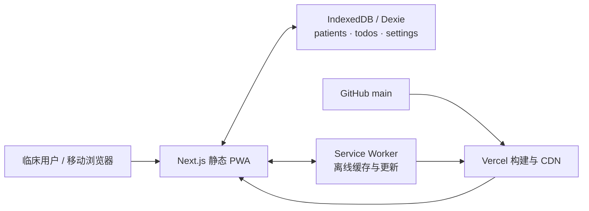

# 系统架构（As Built）

> 状态：当前规范  
> 核对日期：2026-08-17  
> 实现基线：生产/`origin/main` `285b22f`，应用 `2.17.2`

## 1. 系统边界

这是单用户、local-first 的静态 PWA。Vercel 只分发 HTML、JavaScript、CSS、manifest、版本文件和 Service Worker；所有业务数据在浏览器本地处理，没有服务端 API、登录、云同步或远程数据库。

关键隐私结论：业务数据不应流向 GitHub 或 Vercel，但浏览器本地数据没有应用层加密，设备与浏览器账户安全属于系统边界的一部分。

## 2. 运行与构建架构

| 层 | 实现 | 职责 |
| --- | --- | --- |
| 路由/页面 | Next.js 15 App Router | 静态页面、导航和元数据 |
| 交互 | React 19 客户端组件 | 表单、筛选、拖拽、虚拟列表、弹层 |
| 领域逻辑 | `lib/*.ts` | 床号解析、床型、查房顺序、换药、提醒、导入导出 |
| 持久化 | Dexie 4 / IndexedDB | 本地事务、响应式查询、数据迁移 |
| 离线 | `public/sw.js` | 预缓存、同源 GET cache-first、用户确认更新 |
| 构建 | `next build` + 两个脚本 | 静态导出、同步版本、注入预缓存清单 |
| 发布 | GitHub → Vercel | PR Preview；`main` Production |

`next.config.mjs` 使用 `output: "export"`，构建结果位于 `out/`。`scripts/sync-version.mjs` 在构建前把 `package.json` 版本写入 `public/version.json` 和 `public/sw.js`；`scripts/gen-sw-precache.mjs` 在构建后扫描 `out/` 并注入完整资源列表。

## 3. 信息架构

| 路由 | 主要职责 | 数据依赖 |
| --- | --- | --- |
| `/` | 查房首页、筛选、排序、添加/编辑病人、每日小结 | 三表 |
| `/patient` | 通用病人详情壳、病人待办和快捷操作 | `sessionStorage.cc:pid` + 三表 |
| `/todos` | 通用/病人待办聚合与状态筛选 | patients + todos |
| `/settings` | 主题、换药默认规则、导入导出、清空、版本 | 三表 |
| `/settings/rounding` | 查房块和床序配置 | settings |
| `/settings/bed-recognition` | 床号模板、床型与虚拟床覆盖 | patients + settings |
| `/settings/groups` | 分组名称、颜色和顺序 | settings |
| `/settings/quick-todos` | 快捷待办配置 | settings |

病人详情没有动态 URL id。首页或待办页先把 id 写入 `sessionStorage.cc:pid`，再导航到固定 `/patient`。这是为了让静态导出和离线预缓存拥有一个稳定详情壳，代价是详情不可复制为独立深链，多标签页的最近选择也可能互相影响。

## 4. 数据模型与一致性

数据库名 `ClinicalDB`，当前 schema 版本为 1：

- `patients`: `id, bedNumber, name` 索引；包含诊断、分组、手术日期、换药覆盖规则和解析后的床号字段。
- `todos`: `id, patientId, status, dueDate` 索引；既支持病人待办也支持 `patientId` 为空的通用待办。
- `settings`: 单例 `id=1`；包含查房块、列表方向、快捷待办、分组、主题、床号模板、换药默认规则和虚拟床配置。

一致性规则：

- 删除病人和清空数据使用 Dexie 事务；删除病人级联删除其全部待办。
- 设置更新在事务内读改写，避免多个设置页互相覆盖。
- `ensureSettingsMigrated` 在 Providers 挂载时做一次旧结构回填；读取函数保持纯读。
- 导入必须先完整解析/校验，再进入事务替换数据。
- 领域判断的唯一来源应位于 `lib/`；尤其床型统一通过 `computeBedType`，查房顺序统一通过 `resolveOrder`。

## 5. PWA 生命周期

1. 生产页面挂载后注册 `/sw.js`；开发环境默认注销残留 SW，可用 `?sw=1` 联调。
2. install 预缓存静态路由和 `_next/static` 资源，但不自动 `skipWaiting`。
3. 每 60 秒及页面回到前台时检查更新。
4. 新 SW 进入 waiting 后提示用户；只有用户确认才激活并刷新。
5. `version.json` 不预缓存并使用 `no-cache`，用于显示和比较版本。

回滚应用版本不会回滚 IndexedDB。任何数据迁移必须向后兼容旧代码，或在发布前明确“应用不可直接回滚”。

## 6. 质量属性与约束

- 离线优先：核心路由和静态资源必须在首次成功安装后断网可用。
- 数据安全优先：导入、清空、级联删除和迁移属于 L2 变更。
- 临床逻辑可测试：床号、查房、换药、提醒和时间解析保持纯函数并覆盖边界样本。
- 移动端优先：触控目标、非手势等价入口、WCAG 2.1 AA 和 reduced motion 为验收项。
- 性能：首页超过 50 行、待办超过 30 条启用虚拟化；避免在 `useLiveQuery` 读取路径中写库。

## 7. 当前技术债

1. 固定 `/patient` + sessionStorage 不支持可分享深链，也缺少无 id 时的恢复路径产品定义。
2. 全部业务数据只在单一浏览器，备份完全依赖人工导出；没有冲突解决、跨设备同步或恢复演练自动化。
3. 数据库 schema 仍为 v1，字段迁移主要靠应用级回填；未来结构变更应使用明确的 Dexie version 升级。
4. 首屏共享 JS 约 103 kB，主要页面首次加载约 185–202 kB；需要持续监控真实设备 INP/LCP。
5. PRD 已记录 3 个确认缺陷和若干现状边界，须通过 Issue 排期，不应散落在文档中长期无人负责。

架构变化必须通过 ADR 或 PR 的“设计/影响”章节记录，并同步更新本文件、PRD 和相关测试。
