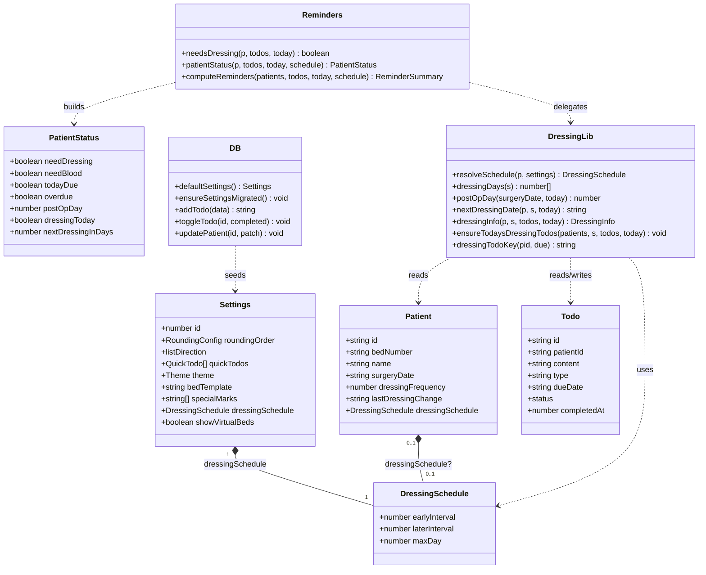
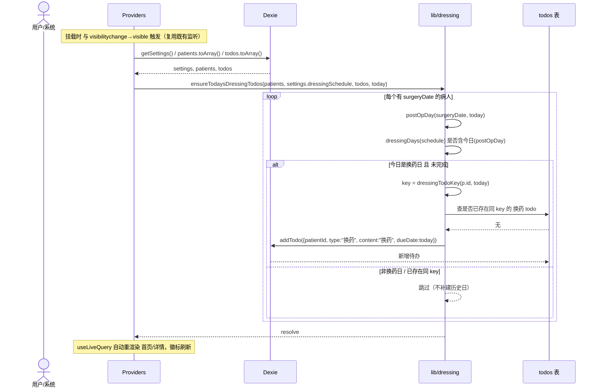
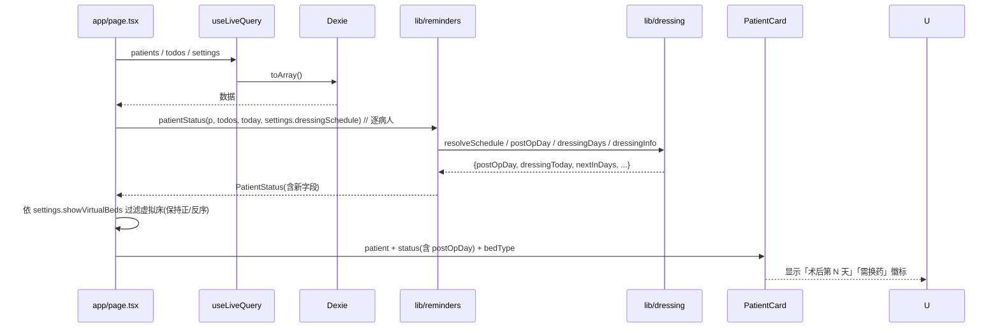

# 换药管理功能升级 v2.17.0 → v2.17.1 — 架构设计与任务分解

> 角色：软件架构师（Bob）｜ 输入：已审核通过的实施方案 + 现有代码调研
> 技术栈：Next.js 15 App Router + TypeScript + Dexie/IndexedDB + Tailwind + Framer Motion（沿用，**无新增依赖**）
> 本文档为工程师可执行的设计依据；类图/时序图另存 `docs/class-diagram.mermaid`、`docs/sequence-diagram.mermaid`。
> **v2.17.1 增量（已交付）**：在 v2.17.0 基础上修复床型识别与筛选、升级换药规则入口、优化 UI 文字拥挤/换行、病人编辑页改为自动保存、修复 bed-parser 自定义模板捕获组数缺陷。详见文末 §9。

---

## 0. 决策摘要（一眼看完）

| 需求 | 关键决策 |
|---|---|
| ① 换药逻辑优化 | 默认规则由 `DressingSchedule{earlyInterval, laterInterval, maxDay}` 描述；首个换药日固定为**术后第 2 天(POD2)**；全局默认在 `Settings.dressingSchedule`，每病人可用 `Patient.dressingSchedule` 覆盖。**废弃** `dressingFrequency`/`lastDressingChange` 的旧驱动逻辑。 |
| ② 待办自动更新 | App 打开 / 回到前台时扫描，按「换药日」为当日且有手术日期的病人 `addTodo` 一条 `type:"换药"`、`dueDate:today` 的待办；去重键 `patientId\|换药\|dueDate`；**只建今天、不补历史日**。 |
| ③ 术后天数显示 | 列表新增「术后第 N 天」；手术日期改用**自定义 DatePicker 组件**（纯 React+Tailwind，不引第三方），替换原生 `<input type="date">`。 |
| ④ 床位折叠 | 范围 = 首页查房列表（`app/page.tsx`）；新增「虚拟床显隐」开关（持久化 `Settings.showVirtualBeds`，默认显示）；正序/反序不受影响。 |

**重要耦合修正（影响到 2 处旧代码 + 1 个旧测试）：**
- `lib/db.ts` `toggleTodo`（约 286–292 行）在完成「换药」待办时写 `lastDressingChange` 的逻辑 **移除**。
- `app/todos/page.tsx` `onToggle`（约 110–114 行）同样写 `lastDressingChange` 的逻辑 **移除**。
- `tests/toggle-dressing.test.ts` 断言上述旧行为，**需改写**为断言新模型（见任务 T01 / QA 任务）。

---

## 1. 实现方案 + 框架选型

**沿用现有栈，不引入任何新依赖。**

- 框架：Next.js 15 App Router（静态预渲染 `/patient`，离线可用）。
- 状态/存储：Dexie + `dexie-react-hooks` `useLiveQuery`（响应式重渲染天然支持「打开即刷新」）。
- 日期计算：全部用本地时区 `YYYY-MM-DD` 字符串 + 纯函数（不引 `date-fns`/`dayjs`）。
- 自定义日期选择器：`components/DatePicker.tsx` 纯组件 + 内部 `viewYear/viewMonth` state，月历网格用 Tailwind 绘制，**不引第三方日历库**。
- 动画：复用既有 Framer Motion（卡片进入/长按已存在），新增交互不加新库。
- 触发时机：复用 `components/Providers.tsx` 已有的 `visibilitychange→visible` 监听（原用于 SW 轮询），在其回调内追加「回到前台扫描建待办」；挂载时亦执行一次。

---

## 2. 文件列表（区分新建 / 修改）

### 新建
- `lib/dressing.ts` — 换药核心算法库（纯函数）。
- `lib/home-filter.ts` — 首页列表过滤纯函数 `filterHomeRows(rows, group, showVirtualBeds, settings?)`，由 `app/page.tsx` 的 `filtered` 内联逻辑抽出（含 `HomeRow`/`HomeGroupItem` 类型）。**虚拟床判定改为完全自动**：`isVirtual = parseBed(p.bedNumber, settings?.bedTemplate, settings?.specialMarks).bedType === "virtual"`（v2.17.1 起忽略手动 `patient.bedType`，不匹配床号模板即判为虚拟床）。关闭虚拟床时按单卡/整组剔除、保序（filterHomeRows 不重排）。
- `components/DatePicker.tsx` — 自定义手术日期选择器。
- `docs/system_design.md`、`docs/class-diagram.mermaid`、`docs/sequence-diagram.mermaid` — 本文档与图。
- `tests/dressing.test.ts` — 新算法单测（建议，随 T01 落地）。
- `tests/virtual-bed.test.ts` — 随 T03 落地，覆盖虚拟床隐藏 + 真实床/加床排序不变 + 分组筛选共存（已落地，全量 109 绿）。

### 修改
- `types/index.ts` — 新增 `DressingSchedule`；`Settings.dressingSchedule`、`Settings.showVirtualBeds?`；`Patient.dressingSchedule?`。
- `lib/db.ts` — `defaultSettings()` 加默认 schedule + `showVirtualBeds`；`ensureSettingsMigrated()` 补默认；`toggleTodo` 移除 `lastDressingChange` 写入。
- `lib/bed-parser.ts` — **v2.17.1 修复**：不匹配床号模板时 fallback 为 `bedType:"virtual"`（仅匹配模板返回 `real`/`extra-real`）；修正自定义模板「捕获组数≠4 即误判 virtual」缺陷（`if(!m)` 判定 + 组数无关防崩提取，补 `tests/bed-parser.test.ts`）。筛选与展示统一以 `parseBed(...).bedType` 为准，不再读手动 `patient.bedType`。
- `lib/reminders.ts` — 重写 `needsDressing`（改为基于待办的「今日/逾期未换药」判定）；扩展 `PatientStatus`（加 `postOpDay`/`dressingToday`/`nextDressingInDays`）；`patientStatus` 接收 schedule 并计算新字段；`computeReminders` 同步。
- `app/settings/page.tsx` — 换药规则升级为 Settings 内**独立醒目可折叠区块**（标题「换药规则」+ 描述 + `ChevronDown` 折叠，默认展开，非路由），绑定全局 `settings.dressingSchedule`（3 个数字输入，整数≥1 校验保留）。
- `components/PatientFormSheet.tsx` — 手术日期换用 `DatePicker`；移除 `dressingFrequency`/`lastDressingChange` 输入；新增可选「每病人自定义换药间隔」覆盖。**v2.17.1：编辑模式移除「保存」按钮，改动经 400ms 防抖 `updatePatient` 自动落库**（必填清空→行内提示不覆盖库；重复床号→行内错误跳过；床号变更重算 `parseBed` 并持久化 `ward/bedBase/bedType/specialType`）。
- `app/page.tsx` — 读 `showVirtualBeds` 加开关；按开关过滤虚拟床（保持正/反序）；给卡片传入 `status.postOpDay` 等。
- `components/PatientCard.tsx` — 新增「术后第 N 天」徽标；`patientCardEqual` 补新 status 字段 + `postOpDay`。
- `components/GroupedPatientCard.tsx` — `groupedEqual` 补新 status 字段 + `postOpDay`（透传）。
- `components/Providers.tsx` — 挂载 + 回到前台触发 `ensureTodaysDressingTodos`。
- `app/patient/page.tsx` — 详情 `Info` 区「换药频率/上次换药」改为「术后天数 / 距下次换药」。
- `components/QuickActions.tsx` — 「换药」按钮去重（已存在今日换药待办则不再重复建）。
- `app/todos/page.tsx` — `onToggle` 移除 `lastDressingChange` 写入。
- `package.json` — 版本 `2.16.1` → `2.17.0` → `2.17.1`（v2.17.1 增量；prebuild 的 `sync-version.mjs` 自动注入 `version.json`/`sw.js`，无需手改其它）。

---

## 3. 数据模型与接口

### 3.1 类型签名（`types/index.ts` 修改）

```ts
/** 换药间隔规则。earlyInterval = 首次换药距手术日的天数（默认 2 ⇒ 首换 POD2）。 */
export interface DressingSchedule {
  earlyInterval: number; // 首次换药距手术日的天数（首换 = POD earlyInterval，默认 2）
  laterInterval: number; // 后续间隔（天）：其后所有间隔
  maxDay: number;        // 最后换药日上限（术后天数），超过不再换药
}

export interface Settings {
  id: number;
  roundingOrder: RoundingConfig;
  listDirection?: "forward" | "reverse";
  quickTodos: QuickTodo[];
  customGroups?: CustomGroup[];
  theme: Theme;
  bedTemplate?: string;
  specialMarks?: string[];
  dressingSchedule: DressingSchedule; // 新增：全局默认换药规则
  showVirtualBeds?: boolean;          // 新增：首页虚拟床显隐（默认 true）
}

export interface Patient {
  id: string;
  bedNumber: string;
  name: string;
  diagnosis: string;
  group?: string;
  groupColor?: string;
  surgeryDate?: string;               // 保留（核心输入）
  dressingFrequency?: number;         // 保留字段但不再参与计算（向后兼容存量数据）
  lastDressingChange?: string;        // 保留字段但不再参与计算（向后兼容存量数据）
  bloodTestDay?: string;
  ward?: string;
  room?: string;
  bedBase?: number;
  bedType?: BedType;
  specialType?: string;
  dressingSchedule?: DressingSchedule; // 新增：每病人覆盖全局默认
  createdAt: number;
  updatedAt: number;
}
```

### 3.2 核心算法库 `lib/dressing.ts`（新建，纯函数）

```ts
import { Patient, Todo, Settings, DressingSchedule } from "@/types";

/** 解析某病人实际生效的换药规则：病人覆盖优先，否则全局默认。 */
export function resolveSchedule(p: Patient, s: Settings): DressingSchedule;

/** 由规则算出所有换药日（术后天数数组，升序）。首个固定为 2。 */
export function dressingDays(s: DressingSchedule): number[];

/** 术后天数：手术日=0，次日=1；未设手术日=null；手术日在未来=负值（术前）。 */
export function postOpDay(surgeryDate?: string, today: string): number | null;

/** 下一次换药日期（YYYY-MM-DD）；超出 maxDay 或无效返回 null。 */
export function nextDressingDate(
  p: Patient, schedule: DressingSchedule, today: string
): string | null;

/** 单病人换药信息聚合。 */
export interface DressingInfo {
  hasSchedule: boolean;   // 是否有手术日期（参与换药跟踪）
  postOpDay: number | null;
  isDressingDay: boolean; // 今天是否为换药日
  doneToday: boolean;     // 今天是否已完成换药（存在已完成换药待办）
  nextInDays: number | null; // 距下次换药剩余天数（isDressingDay 且未完成=0）
}
export function dressingInfo(
  p: Patient, schedule: DressingSchedule, todos: Todo[], today: string
): DressingInfo;

/** 去重键：patientId + type + "换药" + dueDate。 */
export function dressingTodoKey(patientId: string, dueDate: string): string;

/** 打开/回到前台时调用：为当日换药病人建待办（去重、不补历史日）。 */
export function ensureTodaysDressingTodos(
  patients: Patient[], schedule: DressingSchedule, todos: Todo[], today: string
): Promise<void>;
```

**`dressingDays` 算法（可验证、无魔法数字）：**
```
days = [s.earlyInterval]        // 首个换药日 = earlyInterval（默认 2 ⇒ POD2）
day = s.earlyInterval
// 首换日已在 days 中初始化为 earlyInterval（默认 2 ⇒ POD2）
loop:
  next = day + s.laterInterval  // 其后每次间隔 = laterInterval（默认 3）
  if next > s.maxDay: break
  days.push(next); day = next
  // 间隔已在上式用 laterInterval（默认 3）
return days
```
默认 `{earlyInterval:2, laterInterval:3, maxDay:14}` ⇒ 换药日 = `[2,5,8,11,14]`（首换 POD2，其后每 3 天一次，至第 14 天）。

### 3.3 `lib/reminders.ts` 扩展

```ts
// 旧：基于 dressingFrequency + lastDressingChange
// 新：基于「存在 pending 的 换药待办，dueDate 为今日或逾期」
export function needsDressing(p: Patient, todos: Todo[], today: string): boolean;

export interface PatientStatus {
  needDressing: boolean;       // 兼容旧字段：存在今日/逾期未换药待办
  needBlood: boolean;
  todayDue: boolean;
  overdue: boolean;
  postOpDay: number | null;            // 新增
  dressingToday: boolean;              // 新增：今日是换药日且未完成
  nextDressingInDays: number | null;   // 新增：距下次换药天数
}

export function patientStatus(
  p: Patient, todos: Todo[], today: string, schedule?: DressingSchedule
): PatientStatus;

export function computeReminders(
  patients: Patient[], todos: Todo[], today: string, schedule?: DressingSchedule
): ReminderSummary; // needDressing 计数改用 needsDressing(p, todos, today)
```

### 3.4 `lib/db.ts` 改造点

- `defaultSettings()`：增加 `dressingSchedule: { earlyInterval:2, laterInterval:3, maxDay:14 }`、`showVirtualBeds: true`。
- `ensureSettingsMigrated()`：若存量 `settings` 缺 `dressingSchedule` 或 `showVirtualBeds === undefined`，合并默认值后一次性 `put`（沿用既有写回模式，避免读里写回环）。
- `toggleTodo(id, completed)`：**删除**约 286–292 行「completed 且 type==="换药" 时写 `lastDressingChange`」整段。`addTodo`/`updatePatient` 保持不变。

### 3.5 类图（classDiagram）



---

## 4. 程序调用流程（时序图）

### 4.1 App 打开 / 回到前台 → 自动建今日换药待办



### 4.2 首页渲染「术后天数 / 需换药徽标」



---

## 5. 任务列表（有序、含依赖、按实现顺序）

> 分组原则：按模块聚合，每个任务 ≥3 个相关文件；首个任务为基础设施（数据+算法+去耦合），后续任务仅依赖 T01。

### T01 — 基础：数据模型 + 换药算法库 + 旧耦合去耦合
- **源文件**：`types/index.ts`、`lib/dressing.ts`(新)、`lib/db.ts`、`lib/reminders.ts`、`app/todos/page.tsx`、`tests/dressing.test.ts`(新)
- **做什么**：
  1. `types/index.ts` 增加 `DressingSchedule` 与 `Settings/Patient` 新字段。
  2. 新建 `lib/dressing.ts` 实现 §3.2 全部纯函数。
  3. `lib/db.ts`：`defaultSetting` 加默认 schedule+`showVirtualBeds`；`ensureSettingsMigrated` 补默认；**删除** `toggleTodo` 中写 `lastDressingChange` 整段。
  4. `lib/reminders.ts`：重写 `needsDressing`（基于待办）、扩展 `PatientStatus`、改造 `patientStatus`/`computeReminders` 接收并计算 schedule 字段。
  5. `app/todos/page.tsx`：`onToggle` **移除**写 `lastDressingChange`。
  6. 新增 `tests/dressing.test.ts` 覆盖 `dressingDays/postOpDay/dressingInfo/ensureTodaysDressingTodos`；**改写** `tests/toggle-dressing.test.ts`（旧断言已失效）以断言新模型（如完成今日换药待办后不再写 `lastDressingChange`，且 `dressingInfo.doneToday` 正确）。
- **依赖**：无（根任务）。
- **优先级**：P0
- **验收**：`npx tsc --noEmit` 通过；`npm test` 全绿；旧 `toggle-dressing` 测试已改写且通过；`dressingDays({2,3,14})===[2,5,8,11,14]`。

### T02 — 设置与表单：全局间隔 + 自定义日期选择器 + 病人表单改造
- **源文件**：`app/settings/page.tsx`、`components/DatePicker.tsx`(新)、`components/PatientFormSheet.tsx`
- **做什么**：
  1. 新建 `components/DatePicker.tsx`：受控 `value:string`(`YYYY-MM-DD`|"")` + `onChange`；内部 `viewYear/viewMonth` 状态；月历网格（周一始，可配）、左右切月、「今天」快捷；纯 Tailwind，无第三方。
  2. `app/settings/page.tsx`：新增「换药间隔（默认）」区段，3 个 `number` 输入绑定 `updateSettings({ dressingSchedule:{earlyInterval,laterInterval,maxDay} })`。
  3. `components/PatientFormSheet.tsx`：手术日期改 `DatePicker`；移除 `dressingFrequency`/`lastDressingChange` 两个输入；新增可选「每病人自定义换药间隔」开关 + 3 输入，写入 `Patient.dressingSchedule`（取消则 undefined，回退全局）。
- **依赖**：T01（需 `DressingSchedule` 类型与默认）。
- **优先级**：P0
- **验收**：设置页改间隔后持久化、重开仍为新值；表单手术日期可用自定义选择器设置/清除；勾选每病人覆盖后 `db.patients` 该病人 `dressingSchedule` 写入；不勾选则为 undefined。

### T03 — 首页：虚拟床折叠 + 术后天数 / 需换药徽标 / 列表渲染
- **源文件**：`lib/home-filter.ts`(新)、`app/page.tsx`、`components/PatientCard.tsx`、`components/GroupedPatientCard.tsx`
- **做什么**：
  1. `lib/home-filter.ts`（由 `app/page.tsx` 的 `filtered` 内联逻辑抽出）：导出纯函数 `filterHomeRows(rows, bedInfoMap, showVirtualBeds)`，隐藏时剔除 `bedType==="virtual"` 的单卡与整组（组内全虚拟则整组剔除），**保持正/反序不变**；`HomeRow`/`HomeGroupItem` 类型一并导出供组件与单测复用。`app/page.tsx` 改为调用该函数（行为等价、无副作用）。
  2. `app/page.tsx`：读 `settings.showVirtualBeds`（默认 true）；在「列表顺序」控件旁加「虚拟床显隐」开关，写 `updateSettings({ showVirtualBeds })`；过滤改为调用 `filterHomeRows(...)`；逐病人调用 `patientStatus(..., schedule)` 得到含 `postOpDay` 的 status 传入卡片。
  2. `components/PatientCard.tsx`：新增「术后第 N 天」徽标（`status.postOpDay!=null` 时显示，负值显示「术前」）；`patientCardEqual` 增加 `postOpDay` 及新 status 字段比较。
  3. `components/GroupedPatientCard.tsx`：`groupedEqual` 同步增加新字段比较（透传 status/postOpDay）。
- **依赖**：T01（status 新字段）。
- **优先级**：P0
- **验收**：关虚拟床后虚拟床位（含其所在整组）从列表消失，正序/反序均正常；术后天数徽标正确；仅数据变化才触发卡片重渲染（memo 正确）。

### T04 — 自动建待办（前台扫描）+ 详情页展示 + 快捷换药去重
- **源文件**：`components/Providers.tsx`、`app/patient/page.tsx`、`components/QuickActions.tsx`
- **做什么**：
  1. `components/Providers.tsx`：在既有 `visibilitychange→visible` 回调与挂载时，读取 `patients/settings/todos` 后调用 `ensureTodaysDressingTodos(patients, settings.dressingSchedule, todos, today)`（离线可用，仅 Dexie）。
  2. `app/patient/page.tsx`：`Info` 区「换药频率/上次换药」改为「术后天数（POD N）」「距下次换药（N 天后 / 已结束）」，经 `dressingInfo`/`nextDressingDate` 计算。
  3. `components/QuickActions.tsx`：「换药」按钮在建待办前先按 `dressingTodoKey(p.id, today)` 去重，已存在今日换药待办则直接 toast 提示、不再重复建。
- **依赖**：T01（算法）、T02（DatePicker 已落地表单，非直接依赖但同版本）。
- **优先级**：P1
- **验收**：冷启动/切回前台后，当日换药病人自动出现一条 `换药` 待办且幂等（多次触发不重复）；关闭期间不补建历史日；详情页 POD 与距下次换药显示正确；手动「换药」按钮不重复建今日待办。

### T05 — 版本号与文档收尾
- **源文件**：`package.json`、`docs/system_design.md`（本文件）、`docs/class-diagram.mermaid`、`docs/sequence-diagram.mermaid`
- **做什么**：`package.json` 版本 `2.16.1`→`2.17.0`；本设计文档与两张图落地 `docs/`。
- **依赖**：T01–T04。
- **优先级**：P1
- **验收**：`package.json` 版本为 `2.17.0`；`prebuild` 的 `scripts/sync-version.mjs` 能注入 `version.json`/`sw.js`（构建验证由 QA 任务完成）。

---

## 6. 依赖包列表

**确认无新增依赖。** 全部复用现有栈：
- `next@15`、`react`、`typescript`
- `dexie`、`dexie-react-hooks`
- `tailwindcss`、`framer-motion`、`lucide-react`
- 自定义日期选择器仅用 React + Tailwind，不引 `react-day-picker`/`date-fns`/`dayjs` 等。

---

## 7. 共享知识（跨文件约定）

- **schedule 缺省继承链**：`patient.dressingSchedule ?? settings.dressingSchedule`。全局默认由 `defaultSettings()` 保证一定存在，调用方无需判空即可使用。
- **日期格式统一** `YYYY-MM-DD`（本地时区，无 `T`/`Z`）。`todayStr()` 为生成「今天」的唯一来源；`lib/dressing.ts` 内部自制 `parse/加N天` 纯函数，不依赖 `time-parser`。
- **去重键定义**：`dressingTodoKey(patientId, dueDate) = \`${patientId}|换药|${dueDate}\``（即 patientId + type + "换药" + dueDate）。判断是否已存在：遍历 `todos` 找 `t.type==="换药" && t.patientId===pid && t.dueDate===today`。完成与否都算「已存在」→ 不补建。
- **postOpDay 语义**：`null`=未设手术日期；`>=0`=术后第 N 天（手术日=0）；`<0`=术前（手术日期在未来）。
- **首个换药日固定 POD2**，`maxDay` 为最后换药日上限；超过 `maxDay` 后 `nextDressingDate`/`dressingInfo.nextInDays` 返回 `null`（「已结束」）。
- **自动建待办的边界**：仅在 App 打开/回到前台时执行；只建 `dueDate===today` 的待办；App 关闭期间不补建历史日（符合需求②）。
- **徽标驱动**：`needDressing`（兼容旧字段）= 存在 pending 的「换药」待办且 `dueDate<=today`；在自动建待办已运行后等价于 `dressingToday`。`ReminderBar` 的「X 人需换药」计数即 `computeReminders().needDressing`。
- **废弃字段兼容**：`dressingFrequency`/`lastDressingChange` 在 `types` 与 DB 中保留（不删除，避免破坏存量数据导入/导出），但**任何新逻辑都不读取它们**；`PatientForm` 不再提供其编辑入口。
- **首页过滤可测试化**：虚拟床隐藏 + 正/反序保持逻辑统一收敛到纯函数 `filterHomeRows(rows, group, showVirtualBeds, settings?)`（`lib/home-filter.ts`），组件只负责调用；**虚拟床判定完全自动**——`isVirtual = parseBed(p.bedNumber, settings?.bedTemplate, settings?.specialMarks).bedType === "virtual"`，忽略手动 `patient.bedType`（v2.17.1 起）。该模块无 `useLiveQuery`/副作用，可由 `tests/home-filter.test.ts` 与 `tests/bed-parser.test.ts` 直接单测。

---

## 8. 待明确事项（已在 v2.17.0 实现中决断，与代码/测试一致）

1. **默认换药日序列（已决断）**：以需求示例「术后第 2、5、8 天…持续至第 14 天」为准，语义定为 **`earlyInterval` = 首次换药距手术日的天数（首换 = POD `earlyInterval`，默认 `2`）**，`laterInterval` = 首次之后每次换药的间隔（默认 `3`）。算法：首换日 = `earlyInterval`，其后每次 `+= laterInterval` 直到 `> maxDay`。故默认 `{earlyInterval:2, laterInterval:3, maxDay:14}` ⇒ 换药日 `[2,5,8,11,14]`，该断言已在 `tests/dressing.test.ts` 实测通过、QA 复核确认。
2. **早期/后期切换点（已决断）**：采用「首换日 = `earlyInterval`，其后所有间隔 = `laterInterval`」的简单可验证规则（无魔法数字、无显式切换日字段）。
3. **旧字段清理**：`dressingFrequency`/`lastDressingChange` 保留类型定义但不参与计算、表单不再编辑；导入/导出保留旧值以向后兼容。
4. **详情页「上次换药」**：改为「距下次换药」，隐藏「上次换药日期」展示。
5. **测试改写影响**：`tests/toggle-dressing.test.ts` 旧断言已改写为新模型（完成今日换药待办后不再写 `lastDressingChange`，`dressingInfo.doneToday` 正确）；正式回归由 QA 任务执行并全绿。

---

## 9. v2.17.1 增量变更（床型识别修复 + 体验优化，已交付）

> 版本号：`package.json` → `2.17.1`（prebuild 经 `sync-version.mjs` 注入 `version.json`/`sw.js`）。
> 测试：全量 `113/113` 通过（`npx vitest run`）；`tsc` 0 错误、`eslint` 0 error；Vercel 生产构建 `READY`，线上 `version.json=2.17.1`。
> 关键决策：换药规则入口采用「Settings 内联独立分区」（非独立二级路由、非首页）；床型判定采用「完全自动判定」（忽略手动 `patient.bedType`）。

### 9.1 床型识别修复（① + ⑤ 缺陷修复）
- **根因**：v2.17.0 的虚拟床判定依赖「设置-床号识别」中手动写入的 `Patient.bedType` 覆盖值，导致「隐藏虚拟床」开关对未按模板标注的病人失效。
- **修复**：`lib/bed-parser.ts` `parseBed(bedNumber, template, specialMarks)` 语义改为——**仅当床号匹配床号模板**（且特标命中 `specialMarks`）返回 `real`/`extra-real`；**不匹配模板或空床号一律 `virtual`**。筛选与展示统一以 `parseBed(...).bedType` 为准（`app/page.tsx` 的 `filterHomeRows` 调用、`app/patient/page.tsx` 虚拟床徽标均改为 `parsedBed?.bedType === "virtual"`），不再读取手动 `patient.bedType`。
- **潜在缺陷修复（⑤）**：原 `if (!m || m.length < 5)` 隐含「模板恰有 4 捕获组」假设，自定义模板（捕获组数≠4）的合法匹配被误判 `virtual`、导致该床被隐藏。改为 `if (!m)` 判定 + 组数无关防崩提取（`m[1..4]` 缺省回退），并新增 `tests/bed-parser.test.ts` 覆盖「`^([A-Z])(\d{3})(\d{2})$` + `W30901` ⇒ `matched:true, bedType:"real", ward:"W309", bedBase:30901`」。

### 9.2 换药规则入口升级（②）
- `app/settings/page.tsx`：原「换药间隔」编辑区段升级为 Settings 内**独立醒目可折叠卡片**（标题「换药规则」+ 描述 + `ChevronDown` 折叠，默认展开，非路由），仍绑定全局 `settings.dressingSchedule`（整数≥1 校验保留）。入口层级「不用太浅」——在 Settings 内独立分区而非首页，便捷且不过度暴露。

### 9.3 UI 文字拥挤 / 换行优化（③）
- `components/PatientCard.tsx` / `components/GroupedPatientCard.tsx`：卡片文本容器加 `min-w-0 truncate` 防止长床号/诊断溢出拥挤换行；床型徽标统一用传入的解析床型。
- `app/patient/page.tsx`：虚拟床徽标条件统一为 `parsedBed?.bedType === "virtual"`，长床号加 `truncate`。

### 9.4 病人编辑页自动保存（④）
- `components/PatientFormSheet.tsx`：编辑模式（传入 `patient`）**移除「保存」按钮**，改为**改动即自动落库**——400ms 防抖 `updatePatient(id, partial)` 持久化；必填清空→行内提示不覆盖库；重复床号→行内错误跳过；换药字段仅持久化合法值（int≥1、max>early）；床号变更重算 `parseBed` 并持久化 `ward/bedBase/bedType/specialType`；无每次按键 Toast。新增模式保留「添加病人」按钮。

### 9.5 验收结论
- `npx vitest run`：113/113 通过（含新增 `tests/bed-parser.test.ts`）。
- `npx tsc --noEmit` 0 错误；`npx eslint` 0 error。
- Vercel 生产构建 `READY`，线上 `version.json=2.17.1`、首页 HTTP 200。

---

## 10. v2.17.2 增量变更（虚拟床开关真正生效，已交付）

> 版本号：`package.json` → `2.17.2`（prebuild 经 `sync-version.mjs` 注入 `version.json`/`sw.js`）。
> 测试：全量 `142/142` 通过（含 QA 独立回归 `tests/qa2-independent-verify.test.ts` / `tests/qa2-parity.test.ts`）；`tsc` 0 错误、`eslint` 0 error；Vercel 生产构建 `READY`。
> **推翻 v2.17.1 的「床号模板判定」模型**：用户权威业务规则——「只有在查房列表（查房顺序）里的被分配房间和真实加床才是真实床，其他都是虚拟床」。

### 10.1 床型判定唯一真相源改为查房顺序块成员（①）
- **根因（v2.17.1 仍失效）**：v2.17.1 把床型判定压到 `parseBed` 的床号模板匹配上，但真实床号（如 `309Wxx`）本就能被默认模板匹配 → 解析永不产出 `virtual` → 「隐藏虚拟床」开关没有任何床可隐藏，实测无反应。
- **修复**：新增 `lib/bed-type.ts` `computeBedType(p: BedTypeInput, roundingOrder?, virtualOverrides?)`，床型**唯一**由 `roundingOrder.blocks` 的成员关系决定：
  - 复用 `lib/rounding.ts` `resolveOrder` 的**双口径**匹配：块存完整床号（`useFull`）→ 精确 `block.beds.includes(bed)`；基础规则（块内存 `"01"/"02"`）→ 按 `parseInt(bedBase) === p.bedBase` 数值匹配。
  - 命中 `room` 块 → `real`；命中 `extra`/`extra-real` 块 → `extra-real`；都不命中 → `virtual`。
  - `bedTemplate`/`specialMarks` **仅用于展示解析**，不再参与床型判定。
- 调用点统一切换：`app/page.tsx`、`app/patient/page.tsx`、`components/PatientFormSheet.tsx`（新增/编辑两处）、`lib/batch-import.ts`（toAdd/toUpdate）、`app/settings/bed-recognition/page.tsx` 均传 `BedTypeInput`（patient 对象或 `{bedNumber,ward,bedBase}`）。

### 10.2 首页整组按成员过滤（②，修复 virtualOverrides 连坐）
- **根因**：v2.17.2 前的整组逻辑「组内任一 virtual 即剔整组」。当用户把同房 `309W02` 标进 `virtualOverrides`，同块真实床 `309W01` 会被一起藏掉。
- **修复**：`lib/home-filter.ts` `filterHomeRows` 对 group 行改为 `kept = items.filter(it => !isVirtual(it.patient))`；`kept.length === 0` 才剔整组，否则 `items = kept` 仅保留真实成员。

### 10.3 强制虚拟名单 + 床号识别页重构（③④）
- `Settings.virtualOverrides?: string[]`：强制虚拟床名单，优先级高于块匹配；`lib/db.ts` `defaultSettings()` 补 `virtualOverrides: []`。
- 床号识别页重构为「**管理查房块**」：加床进 `room`/`extra` 块即变真实、移出即变虚拟；「重新解析全部」只重算 `ward/bedBase/specialType`，不写 `bedType`。

### 10.4 验收结论
- `npx vitest run`：142/142 通过（含 `tests/bed-type.test.ts`、`tests/virtual-bed.test.ts`、`tests/qa2-independent-verify.test.ts`、`tests/qa2-parity.test.ts`）。
- 关键回归场景由 QA 独立实测（非只看断言）：基础规则下 `REMAIN_WHEN_HIDDEN=["a","b","c"]`（首页不清空）；混合整组 `virtualOverrides` 命中后 `kept=["g1/real1"]`（同病房真实床保住）。
- `npx tsc --noEmit` 0 错误；`npx eslint` 0 error；Vercel 生产构建 `READY`，线上 `version.json=2.17.2`、首页 HTTP 200。
