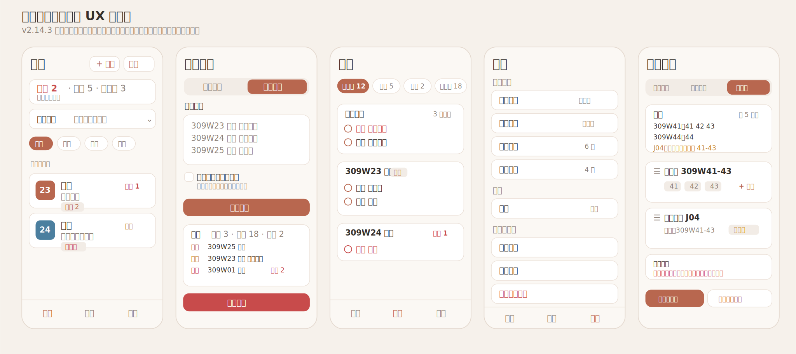

# 临床病人管理助手 UX 改造设计稿

日期：2026-07-11

适用版本：v2.14.3 之后

状态：设计稿 / 待确认后实施

## 0. 页面设计图



## 1. 设计目标

这次改造不追求新增很多入口，而是把现有功能变得更适合每天查房前后反复使用。

核心目标：

1. 降低误操作风险，尤其是批量导入、删除、清空、覆盖类操作。
2. 提高查房时的扫描效率，让用户第一眼知道“谁最急、下一步做什么”。
3. 让设置页从“配置项列表”变成“工作流设置中心”，每个复杂设置都能看到结果预览。
4. 保持本地优先 PWA 的定位，不引入病人详情深链接，不依赖服务端病人数据。
5. 继续保持移动端单手操作，按钮、筛选、底部弹层都服务高频操作。

## 2. 不做的事情

本轮明确不做：

1. 不做 `/patient/{id}` 这类病人详情深链接。
   - 当前病人详情依赖 `sessionStorage` 选择病人，符合离线静态 PWA 的部署方式。
   - 详情页只作为本地运行时页面，不作为可分享链接。

2. 不把首页做成营销式仪表盘。
   - 这不是官网，也不是展示型产品。
   - 页面应当安静、紧凑、可扫读。

3. 不新增复杂权限、登录、云同步。
   - 当前数据是 IndexedDB 本地数据。
   - 部署在 Vercel 只托管静态应用壳，不托管病人数据。

## 3. 使用场景

### 3.1 早晨查房前

用户目标：

- 粘贴最新病人名单。
- 快速知道新增、更新、可能出院/移除的病人。
- 避免误删仍有待办的病人。
- 查看今日到期、逾期、需要换药/查血的任务。

关键页面：

- 查房首页
- 添加病人 Sheet / 批量导入
- 待办页

### 3.2 查房过程中

用户目标：

- 按查房顺序逐个病人查看。
- 快速添加常用待办。
- 一键完成换药/查血类任务。
- 不被过多设置、导入、导出入口干扰。

关键页面：

- 查房首页
- 病人详情页
- 快捷待办

### 3.3 查房后整理

用户目标：

- 查看未完成事项。
- 把已完成事项折叠归档。
- 生成或复制每日小结。
- 导出备份数据。

关键页面：

- 待办页
- 查房首页每日小结
- 设置页数据管理

### 3.4 初次配置或换病区

用户目标：

- 配置床号识别规则。
- 配置查房顺序。
- 配置分组和快捷待办。
- 能在保存前看到结果。

关键页面：

- 设置首页
- 查房顺序设置
- 床号识别设置
- 分组管理
- 快捷待办设置

## 4. 信息架构

底部导航保持三项：

```text
查房        待办        设置
```

建议页面结构：

```text
查房 /
  添加病人 Sheet
    手动添加
    批量导入
  通用待办 Sheet
  病人详情 /patient

待办 /todos
  未完成
  今天
  逾期
  已完成

设置 /settings
  日常工作
    查房顺序
    床号识别
    快捷待办
    分组管理
  数据与备份
    导出数据
    导入数据
    清除全部数据
  应用
    主题
    版本更新
```

## 5. 页面设计

### 5.1 查房首页

目标：一眼知道今日风险，然后按顺序走。

当前问题：

- 首页顶部功能已经完整，但信息层级略平均。
- 每日小结、分组、正序/反序、病人列表都在首屏竞争注意力。
- “列表顺序”这个设置属于临时显示偏好，视觉权重可以更低。

建议布局：

```text
┌────────────────────────────┐
│ 查房             +病人  待办 │
├────────────────────────────┤
│ 今日提醒：逾期 2 · 今日 5    │
│ [查看待办]                  │
├────────────────────────────┤
│ 每日小结  今日暂无完成项   ˅ │
├────────────────────────────┤
│ 全部  轻组  勇组  李组  王组 │
├────────────────────────────┤
│ 309W23  张三        待办 2   │
│ 胫骨骨折   需换药  今日到期  │
├────────────────────────────┤
│ 309W24  李四        逾期 1   │
│ 取除内固定  已逾期  查血     │
└────────────────────────────┘
```

具体调整：

1. 保留顶部两个按钮：添加病人、通用待办。
2. 今日提醒栏作为首要状态：
   - 无风险：显示“今日暂无紧急事项”，视觉弱化。
   - 有今日/逾期任务：显示数量，并可点击进入待办页对应筛选。
   - 有逾期时优先展示逾期。

3. 每日小结默认折叠。
   - 当前首页空数据时小结卡片存在感合适。
   - 有大量病人时，小结不应挤压病人列表。
   - 展开后提供复制、导出。

4. 分组筛选保持横向 chip。
   - 每个 chip 可显示数量，如“勇组 8”。
   - 当前筛选无结果时，空状态提示“当前分组暂无病人”，并提供“查看全部”。

5. 正序/反序改成右侧小菜单或紧凑 segmented control。
   - 这是查房时有用的临时偏好，但不是主任务。
   - 建议文案：`顺序：正向`，点击切换为 `反向`。

6. 病人卡片信息优先级：
   - 第一行：床号、姓名、最高优先级状态。
   - 第二行：诊断。
   - 第三行：待办 badge、换药、查血、逾期、今日到期。

7. 病人卡片状态排序：
   - 逾期
   - 今日到期
   - 需换药
   - 需查血
   - 普通待办数

验收标准：

- 首屏至少能看到 3 张普通病人卡片，除非提醒内容确实很多。
- 有逾期任务时，首页不需要进入待办页也能感知风险。
- 正序/反序切换不改变查房顺序配置本身。

### 5.2 病人详情页

目标：查房过程中快速确认病人、快速记录、快速离开。

当前问题：

- 信息完整，但“操作区”和“信息区”的层级还可以更明确。
- 快捷操作、快捷待办、待办列表都存在，应该形成一个临床闭环。

建议布局：

```text
┌────────────────────────────┐
│ ‹ 张三                 编辑 │
│ 309W23 · 胫骨骨折           │
│ 勇组 · 需换药 · 今日到期     │
├────────────────────────────┤
│ 手术日期   2026-07-01       │
│ 上次换药   2026-07-09       │
│ 换药频率   2 天             │
│ 查血日     周一/周四         │
├────────────────────────────┤
│ 快速操作                    │
│ [完成换药] [完成查血] [加待办]│
├────────────────────────────┤
│ 快捷待办                    │
│ [复查片] [拆线] [明早查血]   │
├────────────────────────────┤
│ 待办                        │
│ □ 今日 复查血常规            │
│ □ 明早 复查片                │
│ 已完成 2 ˅                  │
└────────────────────────────┘
```

具体调整：

1. 顶部病人身份区固定为“姓名 + 床号 + 诊断 + 状态”。
2. 详情信息用两列紧凑展示，缺失项显示弱化占位。
3. 快速操作区域只放真正高频动作：
   - 完成换药
   - 完成查血
   - 添加待办
4. 快捷待办区使用设置里的模板。
5. 完成待办后要有即时反馈：
   - toast：“已完成 · 撤销”
   - 如果是换药类，同时更新上次换药日期。
6. 已完成待办默认折叠。
7. 删除病人放到底部危险区，保持二次确认。

验收标准：

- 添加一个常用待办不超过 2 次点击。
- 完成换药后，病人的换药状态立即消失或更新。
- 返回首页后滚动位置仍恢复。

### 5.3 待办页

目标：管理未完成事项，尤其是逾期和今天到期。

当前问题：

- 筛选项可用，但缺少数量提示。
- 完成后用户需要确认任务去了哪里。
- 逾期/今天任务应该天然更靠前。

建议布局：

```text
┌────────────────────────────┐
│ 待办                        │
├────────────────────────────┤
│ 未完成 12  今天 5  逾期 2   │
│ 已完成 18                   │
├────────────────────────────┤
│ 通用待办              3 进行中│
│ □ 逾期 复查化验              │
│ □ 今天 通知家属              │
├────────────────────────────┤
│ 309W23 张三 · 勇组            │
│ □ 今天 复查片                │
│ □ 明早 换药                  │
├────────────────────────────┤
│ 309W24 李四                  │
│ □ 逾期 查血                  │
└────────────────────────────┘
```

具体调整：

1. 筛选 chip 显示数量：
   - 未完成 12
   - 今天 5
   - 逾期 2
   - 已完成 18

2. 默认筛选仍为“未完成”。
3. 未完成内排序：
   - 逾期
   - 今天
   - 明天/未来
   - 无日期

4. 通用待办置顶是合理的，但需要更清楚地区分：
   - 作为一个固定 section。
   - 标题显示当前筛选下的数量。

5. 病人待办分组标题建议包含：
   - 床号
   - 姓名
   - 分组 badge
   - 逾期/今日数量

6. 增加快捷延期能力：
   - 左滑或更多菜单里提供“改到今天 / 明天 / 无日期”。
   - 这比删除再新增更符合真实整理流程。

7. 完成任务后的反馈：
   - toast：“已完成 · 撤销”
   - 当前筛选为未完成时，任务离开列表。
   - 当前筛选为已完成时，任务保留并显示完成时间。

验收标准：

- 用户进入待办页后，能在 1 秒内判断逾期数量。
- 完成任务可撤销。
- 已完成列表不干扰未完成列表。

### 5.4 添加病人 Sheet

目标：手动新增和批量导入都可用，但批量导入必须更安全。

当前问题：

- 批量导入中的“移除未出现的病人”默认开启，风险偏高。
- 预览信息已有，但还可以更像“导入审计”。

建议布局：

```text
┌────────────────────────────┐
│ 添加病人                    │
│ [手动添加] [批量导入]        │
├────────────────────────────┤
│ 粘贴名单                    │
│ ┌────────────────────────┐ │
│ │ 309W23 张三 胫骨骨折     │ │
│ │ 309W24 李四 ...         │ │
│ └────────────────────────┘ │
│ □ 同步移除名单中未出现病人   │
│ [预览导入]                  │
├────────────────────────────┤
│ 预览                        │
│ 新增 3 · 更新 18 · 移除 2    │
│                              │
│ 新增                         │
│ + 309W25 王五                │
│ 更新                         │
│ ~ 309W23 张三 诊断变化        │
│ 移除                         │
│ ! 309W01 赵六 仍有 2 个待办   │
│ [确认导入]                   │
└────────────────────────────┘
```

具体调整：

1. “同步移除名单中未出现病人”默认关闭。
2. 复选框旁给短文案：
   - 未勾选：只新增/更新，不删除现有病人。
   - 勾选：会删除未出现在本次名单中的病人及其待办。

3. 点击预览后分组展示：
   - 新增
   - 更新
   - 移除
   - 跳过/识别失败

4. 移除列表中必须显示待办数量。
5. 如果要移除的病人存在未完成待办：
   - 确认按钮使用危险色。
   - 二次确认文案明确列出姓名和待办数量。

6. 导入完成 toast：
   - “已导入：新增 3、更新 18、移除 0”
   - 如果有跳过行，toast 或预览区提醒“有 2 行未识别”。

验收标准：

- 默认导入不会删除任何病人。
- 删除任何带未完成待办的病人必须二次确认。
- 用户确认前能看到新增、更新、移除、跳过数量。

### 5.5 设置首页

目标：把设置按使用频率和风险分层。

当前问题：

- 设置页当前分组可读，但“主题”占据了最上方首屏。
- 对临床工作来说，更常用的是查房顺序、床号识别、快捷待办、分组。
- 危险数据操作需要更明确分区。

建议布局：

```text
┌────────────────────────────┐
│ 设置                        │
├────────────────────────────┤
│ 日常工作                    │
│ 查房顺序              309W默认│
│ 床号识别              已配置  │
│ 快捷待办              6 个模板│
│ 分组管理              4 个分组│
├────────────────────────────┤
│ 显示                        │
│ 主题                  系统    │
├────────────────────────────┤
│ 数据与备份                  │
│ 导出数据                    │
│ 导入数据                    │
│ 清除全部数据                │
├────────────────────────────┤
│ 应用                        │
│ 当前版本 v2.14.3             │
│ [检查更新]                  │
└────────────────────────────┘
```

具体调整：

1. 把“日常工作”放在第一组：
   - 查房顺序
   - 床号识别
   - 快捷待办
   - 分组管理

2. 主题放进“显示”组，不再占据页面最上方。
3. 每个设置入口右侧显示当前摘要：
   - 查房顺序：默认规则 / 基础规则 / 自定义规则
   - 床号识别：已配置 / 未配置
   - 快捷待办：N 个模板
   - 分组管理：N 个分组

4. 数据与备份分为普通操作和危险操作：
   - 导出数据
   - 导入数据
   - 清除全部数据

5. 清除全部数据保持红色，但不要和普通操作混在一起。

验收标准：

- 用户进入设置页，首屏能看到查房相关设置。
- 危险操作不能被误认为普通入口。
- 每个设置项能看到当前状态摘要。

### 5.6 查房顺序设置页

目标：用户知道当前使用哪条规则，也知道最终首页会怎么排。

当前问题：

- 功能强，但长列表编辑时认知压力高。
- 缺少“最终结果预览”和明显的校验反馈。

建议布局：

```text
┌────────────────────────────┐
│ ‹ 查房顺序                  │
├────────────────────────────┤
│ 当前规则                    │
│ [默认规则] [基础规则] [自定义]│
├────────────────────────────┤
│ 预览                        │
│ 309W41: 41 42 43             │
│ 309W44: 44                  │
│ J04: 真实加床，归属 41-43    │
├────────────────────────────┤
│ 规则块                      │
│ ☰ 病房块 309W41-43           │
│ 41  42  43                  │
│ + 添加床号                  │
│                              │
│ ☰ 真实加床 J04               │
│ 归属：309W41-43              │
├────────────────────────────┤
│ [添加病房块] [添加真实加床块] │
│ 导入 / 导出                  │
└────────────────────────────┘
```

具体调整：

1. 顶部明确当前规则状态：
   - 默认规则
   - 基础规则
   - 自定义规则

2. 增加“预览”折叠区，默认展开前 5 个块。
3. 预览显示最终用于首页排序的结果，而不是原始配置。
4. 校验规则：
   - 同一个床号不能重复出现在多个块中。
   - 空块需要提示。
   - 真实加床必须有归属。
   - 虚拟床不应进入查房顺序。

5. 长列表中每个块只显示必要信息：
   - 类型
   - 床号
   - 数量
   - 警告状态

6. 编辑块时再展开具体床号。
7. 导入/导出放底部高级区。

验收标准：

- 用户保存前能看到前几项实际查房顺序。
- 重复床号、空块、真实加床未归属都能被提示。
- 设置页中反序不出现，反序只在首页作为显示偏好。

### 5.7 床号识别设置页

目标：配置床号解析时，用户能即时看到样例结果。

建议布局：

```text
┌────────────────────────────┐
│ ‹ 床号识别                  │
├────────────────────────────┤
│ 识别模板                    │
│ [正则/模板输入框]            │
│ [测试样例]                  │
├────────────────────────────┤
│ 样例结果                    │
│ 309W23 -> 病区 309W / 床号 23│
│ 309WJ04 -> 加床 / J04        │
│ 309WYZ01 -> 虚拟床           │
├────────────────────────────┤
│ 特殊标记                    │
│ J   加床                    │
│ YZ  虚拟床                  │
├────────────────────────────┤
│ [重新解析全部病人]           │
└────────────────────────────┘
```

具体调整：

1. 模板输入必须即时校验。
2. 正则错误不能保存。
3. 样例测试结果直接展示：
   - 原始床号
   - 病区
   - 基础床号
   - 类型
   - 特殊标记

4. “重新解析全部病人”是批量操作，需要确认。

验收标准：

- 错误模板不会写入设置。
- 用户不用导入真实名单也能测试样例。
- 重新解析前提示影响范围。

### 5.8 快捷待办设置页

目标：让快捷待办更像模板，而不仅是标签列表。

建议布局：

```text
┌────────────────────────────┐
│ ‹ 快捷待办                  │
├────────────────────────────┤
│ ☰ 复查片              其他   │
│ ☰ 明早查血            查血   │
│ ☰ 换药                换药   │
├────────────────────────────┤
│ 添加模板                    │
│ 名称 [          ]            │
│ 类型 [其他/换药/查血]         │
│ 默认到期 [无/今天/明早/明天]  │
│ [添加]                      │
└────────────────────────────┘
```

具体调整：

1. 当前快捷待办可以继续保持简单。
2. 建议增加可选字段：
   - 类型
   - 默认到期时间

3. 对于临床常用模板：
   - “明早查血”应能自动解析为明天。
   - “今天复查片”应能自动设为今天。

4. 拖拽排序保留。

验收标准：

- 点击快捷待办后，待办类型和到期日期符合模板。
- 不配置类型/日期时，保持当前简单行为。

### 5.9 分组管理页

目标：分组服务筛选和视觉识别，不变成复杂标签系统。

建议布局：

```text
┌────────────────────────────┐
│ ‹ 分组管理                  │
├────────────────────────────┤
│ ☰ 勇组       ●              │
│ ☰ 李组       ●              │
│ ☰ 王组       ●              │
├────────────────────────────┤
│ 添加分组                    │
│ 名称 [          ]            │
│ 颜色 [● ● ● ● ●]             │
│ [添加]                      │
└────────────────────────────┘
```

具体调整：

1. 分组数量不建议过多。
2. 分组颜色要保证文字对比度。
3. 删除分组时：
   - 不删除病人。
   - 仅清空或保留病人上的旧分组，需要明确提示。

建议行为：

- 删除分组时，询问：“是否同时从病人身上移除此分组？”
- 默认只删除分组配置，不改病人数据，避免意外批量修改。

验收标准：

- 分组颜色在浅色/深色模式下都可读。
- 删除分组不会删除病人。

## 6. 通用组件规则

### 6.1 按钮

1. 主操作使用 `btn-primary`。
2. 次操作使用 `btn-secondary`。
3. 危险操作使用红色，且配确认弹窗。
4. 同一屏不应出现多个同权重主按钮，除非是底部 Sheet 的“预览/确认”双操作。

### 6.2 Badge

状态 badge 优先级：

1. 逾期：危险色。
2. 今日到期：警告色。
3. 需换药：危险或强调色。
4. 需查血：警告色。
5. 普通待办：主色。
6. 虚拟床/加床：信息色/特殊色。

### 6.3 Bottom Sheet

用于：

- 添加/编辑病人
- 添加/编辑待办
- 批量导入
- 简短菜单

规则：

1. Sheet 顶部标题必须说明当前任务。
2. 表单主按钮固定在表单底部。
3. 危险操作不放在普通表单的主按钮位置。
4. 长内容 Sheet 允许滚动，但底部操作按钮应始终容易找到。

### 6.4 空状态

空状态文案应该告诉用户下一步，而不是只说“没有”。

示例：

- 首页无病人：`暂无病人` / `添加或批量导入第一个病人`
- 分组无结果：`当前分组暂无病人` / `切换分组或查看全部`
- 待办无结果：`没有符合条件的待办` / `切换筛选或添加待办`

## 7. 关键逻辑优化

### 7.1 批量导入安全逻辑

推荐改动：

1. `removeAbsent` 默认值改为 `false`。
2. 预览前不允许确认导入。
3. 勾选移除时，预览区必须展示移除名单。
4. 移除名单里如果有未完成待办，必须二次确认。
5. 二次确认弹窗展示：
   - 病人姓名
   - 床号
   - 未完成待办数量

### 7.2 待办完成逻辑

推荐改动：

1. 完成待办后提供撤销。
2. 换药类待办完成时同步更新病人的 `lastDressingChange`。
3. 已完成任务默认折叠。
4. 待办页提供快捷延期。

### 7.3 设置预览逻辑

推荐改动：

1. 查房顺序设置页增加 `resolveOrder` 结果预览。
2. 床号识别设置页增加 `parseBed` 样例预览。
3. 数据导入增加覆盖预览。

### 7.4 更新逻辑

当前版本更新机制已经比较完整。

建议 UI 调整：

1. 版本更新放在设置页底部“应用”区域。
2. 发现新版本时显示：
   - 当前版本
   - 可用版本
   - 更新按钮
3. 文案明确“本地病人数据不会被应用更新删除”。

## 8. 实施优先级

### P0：先做安全和临床闭环

1. 批量导入默认不删除未出现病人。
2. 批量导入预览重构。
3. 待办完成后撤销。
4. 换药待办完成后同步换药日期。

原因：

- 这些改动直接降低误删和状态错误风险。
- 对现有页面结构影响小，收益高。

### P1：提升首页和待办页效率

1. 首页每日小结默认折叠。
2. 首页病人卡片状态优先级调整。
3. 待办筛选显示数量。
4. 待办排序按逾期/今日优先。

原因：

- 改善每日使用感。
- 不会改变数据模型。

### P2：设置页重构

1. 设置首页重新分组。
2. 查房顺序增加预览和校验。
3. 床号识别增加样例测试。
4. 快捷待办模板增强。

原因：

- 设置页改动更大，但对长期可维护性有帮助。

## 9. 验收清单

### 9.1 首页

- [ ] 有逾期任务时，首页提醒栏优先显示逾期。
- [ ] 每日小结默认折叠，展开后可复制/导出。
- [ ] 分组筛选为空时提供“查看全部”。
- [ ] 正序/反序只影响首页显示，不修改查房顺序配置。

### 9.2 批量导入

- [ ] 默认不删除未出现在名单中的病人。
- [ ] 必须先预览才能确认导入。
- [ ] 预览显示新增、更新、移除、跳过。
- [ ] 删除带未完成待办的病人必须二次确认。
- [ ] 导入完成后显示统计结果。

### 9.3 待办

- [ ] 筛选 chip 显示数量。
- [ ] 逾期任务排在今天任务之前。
- [ ] 完成待办后可撤销。
- [ ] 已完成任务默认折叠。
- [ ] 换药任务完成后更新病人换药状态。

### 9.4 设置

- [ ] 设置首页首屏显示日常工作设置。
- [ ] 危险数据操作独立分区。
- [ ] 查房顺序设置有结果预览。
- [ ] 床号识别设置有样例测试。
- [ ] 正则/模板错误不能保存。

## 10. 测试建议

### 10.1 单元测试

需要覆盖：

1. 批量导入 `removeAbsent=false` 时不删除任何现有病人。
2. 批量导入 `removeAbsent=true` 时正确生成移除预览。
3. 带未完成待办的移除病人能被标记为高风险。
4. 待办排序：逾期 > 今天 > 未来 > 无日期。
5. 快捷待办默认日期解析。
6. 床号识别模板错误处理。

### 10.2 E2E 测试

需要覆盖：

1. 添加病人 -> 添加待办 -> 完成待办 -> 撤销。
2. 批量导入预览 -> 不勾选移除 -> 导入后旧病人仍存在。
3. 批量导入预览 -> 勾选移除 -> 带待办病人触发二次确认。
4. 查房顺序设置 -> 修改块 -> 首页顺序变化。
5. 设置页检查更新按钮仍可用。

### 10.3 可访问性测试

需要覆盖：

1. 所有图标按钮有 `aria-label`。
2. 危险确认弹窗可键盘操作。
3. 颜色对比度满足 WCAG AA。
4. Bottom Sheet 打开时焦点不丢失。

## 11. 推荐下一步

建议先按 P0 实施：

1. 批量导入安全改造。
2. 待办完成撤销与换药联动确认。

这两块最贴近真实临床风险，代码改动也比较集中。完成后再做首页信息层级和设置页重构，会更稳。
